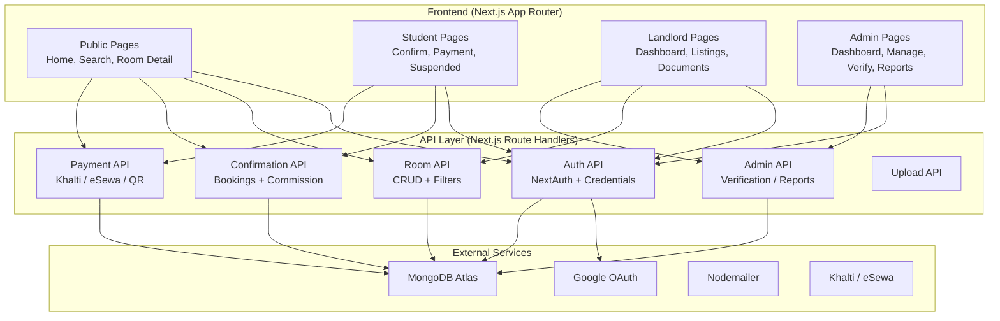
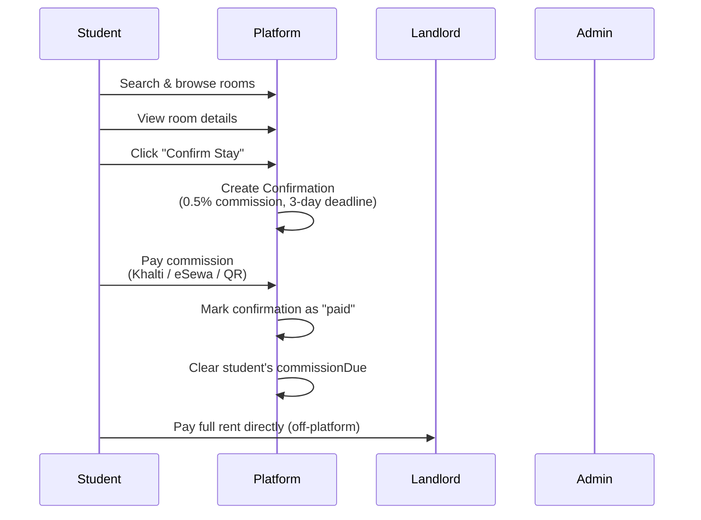
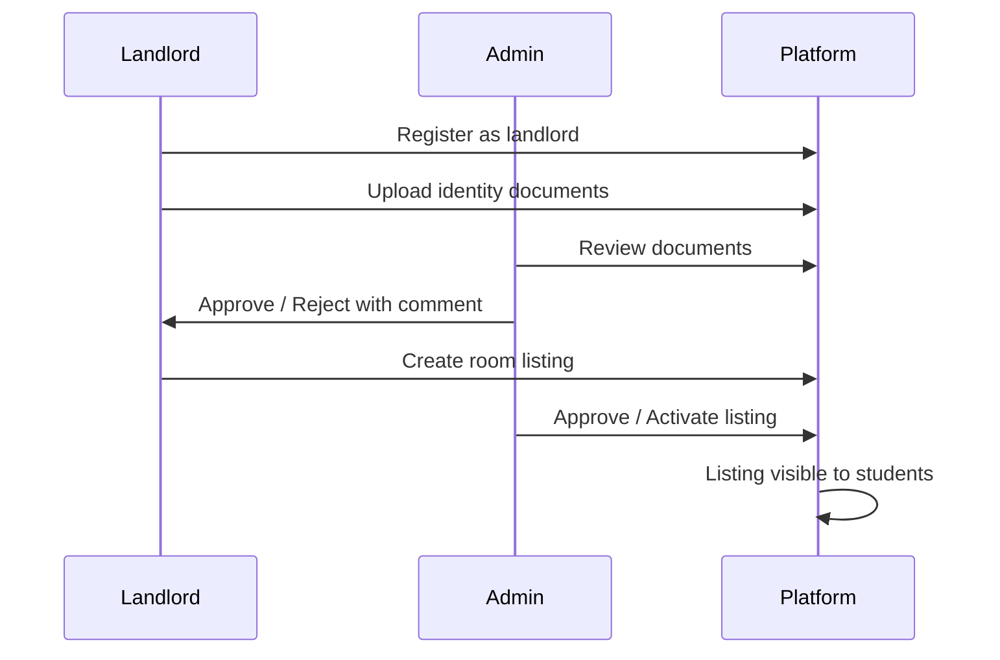

# RoomRent - Room Rental Marketplace for Nepal

A full-stack room rental marketplace connecting **students** (tenants) with **landlords** in Nepal. Built with Next.js 16, MongoDB, and TypeScript.

## Problem Statement

Finding rental rooms in Nepal is fragmented and trust-deficient:
- Students struggle to find verified, legitimate rental listings
- Landlords lack a digital platform to showcase properties
- No streamlined system for booking confirmations or commission payments
- Manual document verification leads to fraud and disputes

RoomRent solves this by providing a centralized, verified marketplace with a structured booking and payment flow.

## System Architecture



## Booking & Payment Flow



## Administrative Flow



## Role-Based Access

```mermaid
graph LR
    subgraph Roles
        R1[Student]
        R2[Landlord]
        R3[Admin]
    end

    subgraph "Student Routes"
        S[/search<br/>/rooms/[id]<br/>/confirm/[id]<br/>/payment/[id]<br/>/suspended]
    end

    subgraph "Landlord Routes"
        L[/landlord/dashboard<br/>/landlord/listings<br/>/landlord/listings/new<br/>/landlord/documents<br/>/landlord/payments]
    end

    subgraph "Admin Routes"
        A[/admin/dashboard<br/>/admin/listings<br/>/admin/students<br/>/admin/verify<br/>/admin/qrcode<br/>/admin/reports]
    end

    R1 --> S
    R2 --> L
    R3 --> A
```

## Key Features

- **Multi-role auth**: Student, Landlord, Admin — with Google OAuth + email/password
- **Room search & filtering**: By location, price range, facilities
- **Booking confirmation**: Students confirm rooms; 0.5% commission generated
- **Payment gateway**: Khalti, eSewa, and QR Code commission payments
- **Account suspension**: Auto-suspension for overdue commissions with reactivation flow
- **Landlord verification**: Document upload (citizenship, passport, etc.) with admin approval
- **Admin dashboard**: Stats, charts, listing/student management, QR code generator, reports
- **Multilingual**: English and Nepali (i18n)
- **Dark/light theme**: next-themes with OKLCH color palettes

## Tech Stack

| Frontend | Backend | Database | Auth | Payments |
|---|---|---|---|---|
| Next.js 16 (App Router) | Next.js API Routes | MongoDB / Mongoose | NextAuth v5 (Google + Credentials) | Khalti, eSewa, QR Code |
| React 19, TypeScript 5 | Zod validation | MongoDB Atlas | bcryptjs | nodemailer |
| Tailwind CSS 4 | Server Actions | | JWT sessions | |
| lucide-react, react-toastify | | | | |

## Getting Started

### Prerequisites

- Node.js 18+
- MongoDB Atlas URI (or local MongoDB)
- Google OAuth credentials (for sign-in)
- Khalti & eSewa merchant credentials (for payments)

### Environment Variables

Copy `.env.local.example` to `.env.local` and fill in your credentials:

```bash
cp .env.local.example .env.local
```

Required variables:
- `MONGODB_URI` — MongoDB connection string
- `AUTH_SECRET` — NextAuth secret
- `AUTH_GOOGLE_ID` / `AUTH_GOOGLE_SECRET` — Google OAuth
- `NEXT_PUBLIC_APP_URL` — e.g. `http://localhost:3000`
- `KHALTI_SECRET_KEY` / `ESEWA_MERCHANT_ID` — Payment gateways
- `SMTP_HOST` / `SMTP_USER` / `SMTP_PASS` — Email (Nodemailer)

### Install & Run

```bash
npm install
npm run dev
```

Open [http://localhost:3000](http://localhost:3000).

## Project Structure

```
src/
├── app/               # App Router pages & API routes
│   ├── api/           # REST API endpoints
│   ├── admin/         # Admin dashboard pages
│   ├── landlord/      # Landlord pages
│   ├── login/         # Auth pages
│   └── ...
├── components/        # Reusable UI components
├── lib/               # Utilities, DB, models, auth config, validations
├── locales/           # i18n (en.json, np.json)
├── types/             # TypeScript definitions
└── middleware.ts      # Route protection
```
